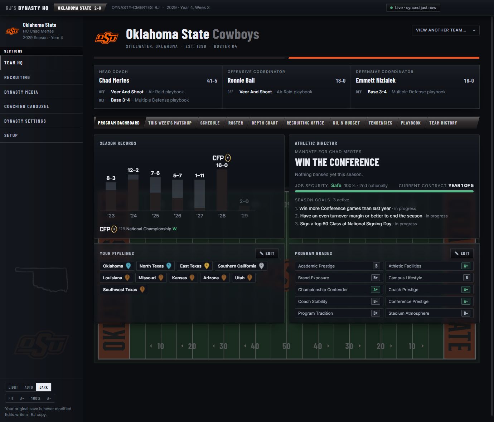
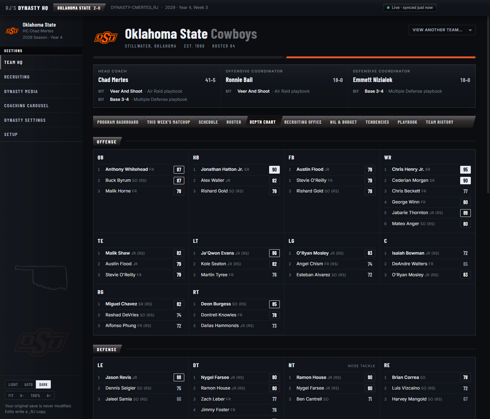
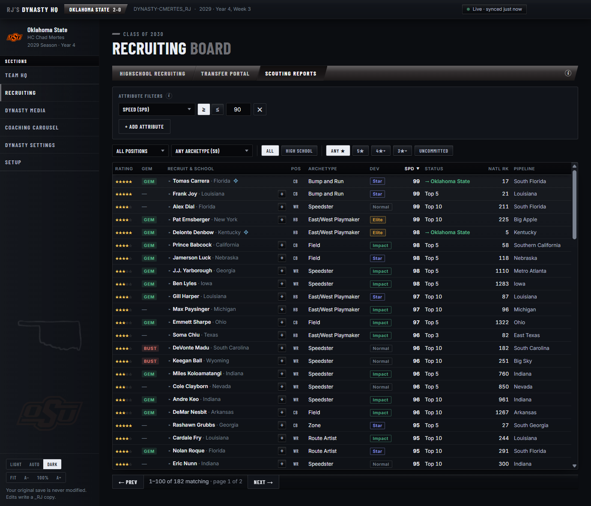
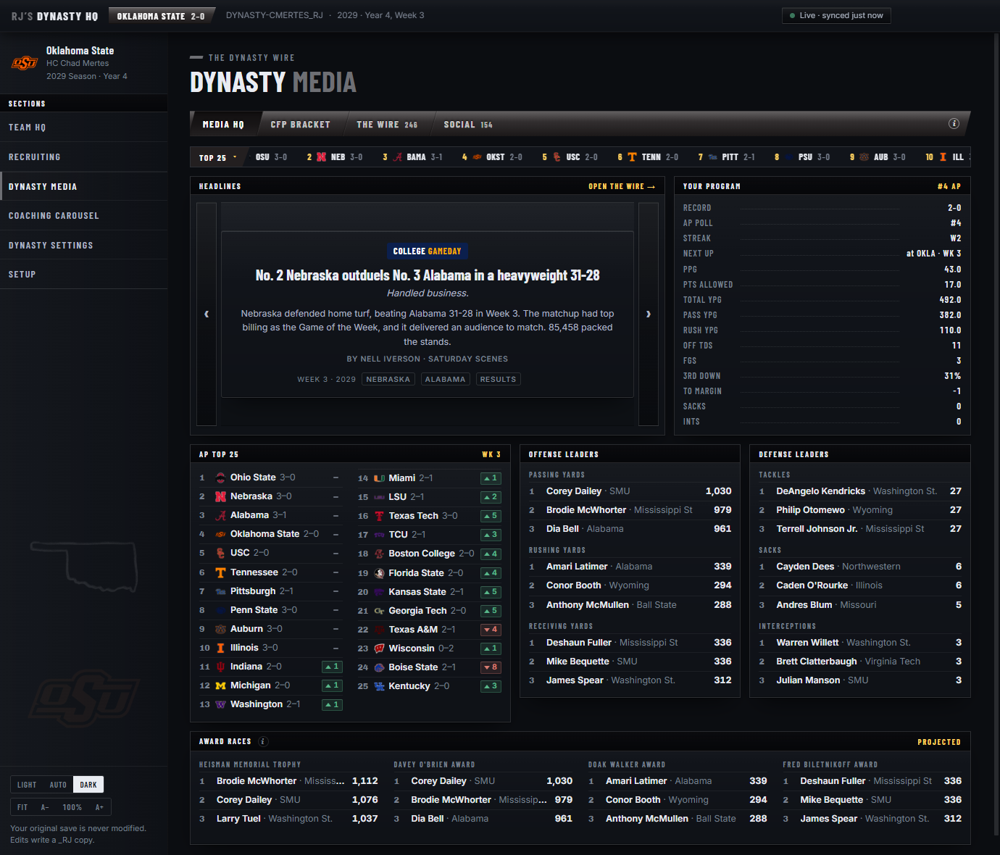

# RJ's Dynasty HQ

A live companion dashboard for **EA Sports College Football 27** dynasty mode on PC.

Point it at your dynasty save once — from then on, every time the game writes that save, the dashboard refreshes itself. No screenshots, no spreadsheets, no manual entry.



## What it does

### Team HQ

Everything about your program, in one place.

- **Program Dashboard** — a win/loss graph of your last eight seasons in your school's colors, with national titles carrying the CFP mark and every bowl showing its own logo. Beside it, your **athletic director's mandate**: this season's expectation, a job-security meter with your national standing, contract years remaining, and the year-by-year record of your tenure.
- **Roster & depth chart** — overalls, dev traits, class years, redshirts, size and speed, archetypes and hometowns; the full depth chart including situational spots. Every column sorts.
- **Targets** — your recruiting board with gem/bust flags, NIL offers, scheduled visits, national and position ranks, and the week-over-week influence swing in each pursuit race.
- **NIL & Budget** — income pillars with grades, spending against the league average, weekly staff points, NIL commitments.
- **Tendencies** — your real run/pass splits, third and fourth down rates, red-zone efficiency, and each coach's temperament sliders.
- **Playbook** — the actual book your coordinators run, browsable by formation family, with personnel groupings and every play listed.



### Recruiting

Three boards over the national class.

- **Highschool Recruiting** — every prospect in the class with stars, gem/bust, dev trait, pipeline, position and national rank, offers, and the schools chasing them. All twelve columns sort, results page 200 at a time, and **clicking any recruit expands a card** with their archetype, measurables, position-relevant attributes and their mental and physical abilities.
- **Transfer Portal** — the same board for portal transfers, which fills once your save reaches the offseason window.
- **Scouting Reports** — search the class by attribute. *Receivers with 92+ speed and 90+ acceleration. Quarterbacks with 94+ throw power. Tackles over 6'6" and 300 pounds.* Stack as many thresholds as you like; **each one becomes its own sortable column** so you can compare at a glance. Filter down to a role (Sam vs Will, tackle vs guard) and a specific archetype.
- **Your edge** — flags recruits where your pipelines and program grades genuinely beat the schools actually competing for them.



### Dynasty Media

A generated news wire built by diffing your saves: game stories with margin-aware writing, poll movement, commits and flips, coaching changes and roster churn — each filed under an outlet masthead. Real network branding by default, a fictional pack one toggle away.



### Throughout

- **Auto-sync** — watches your save and re-reads it the moment the game writes. A status pill shows live/parsing/error at all times.
- **Real branding** — all 138 team logos and every bowl logo ship with the app; no downloads, no setup.
- **Correct names** — archetypes read the way the game shows them (Speedster, Contact Seeker, Edge Setter), read directly out of the game's own data rather than transcribed.
- **Team colors & themes** — the UI accents itself with your school's colors from the save; light, dark and system themes; remembers your save, school and window.

Everything works fully offline. Articles come from a deterministic template engine — no accounts, no API keys, no network calls. The only exception is an optional launch-time update check, which you can switch off.

## Requirements

- Windows 10/11
- EA Sports College Football 27 on PC (Steam, EA App, or Epic)
- An **offline (solo) dynasty** — online dynasty data lives on EA's servers, not in a local file

## Install

Grab the installer from the [Releases](../../releases) page and run it. That's it.

Your dynasty saves normally live in:

```
Documents\EA SPORTS College Football 27\saves\
```

The app auto-detects saves there (files starting with `DYNASTY-`) and lists them on first launch.

## Is my save safe?

Yes. The app never modifies your save: it copies the file to its own cache folder before parsing and never opens the original for writing.

The optional player editor follows the same rule by writing somewhere else entirely — using **Edit** in a player's profile creates a separate copy of your dynasty named `<save>_RJsEdited` next to the original and puts the changes there. Your original file keeps its exact bytes. Re-editing an edited copy updates that copy in place, after a timestamped backup is stored in the app's data folder. Load the `_RJsEdited` save in the game to play with your changes.

## Build from source

```
npm install
npm run dev          # run in development
npm run parse:check  # parse a save from samples/ and print what the app sees
npm run dist         # build the Windows installer (release/)
```

Drop a dynasty save into `samples/` (gitignored) for `parse:check` and development.

Developer tools worth knowing about:

```
node scripts/filter-check.ts        # assert the recruiting filters and scouting queries hold
node scripts/archetype-profile.ts   # rating fingerprint of every archetype
node scripts/extract-archetypes.ts  # regenerate archetype names from the installed game
```

## Credits

- Save parsing is built on [madden-franchise](https://github.com/bep713/madden-franchise) (MIT) by bep713 — the backbone of the Madden/CFB save-editing community.
- Thanks to the CFB 27 modding community for the collective knowledge about the dynasty save format.

## License

[MIT](LICENSE)
