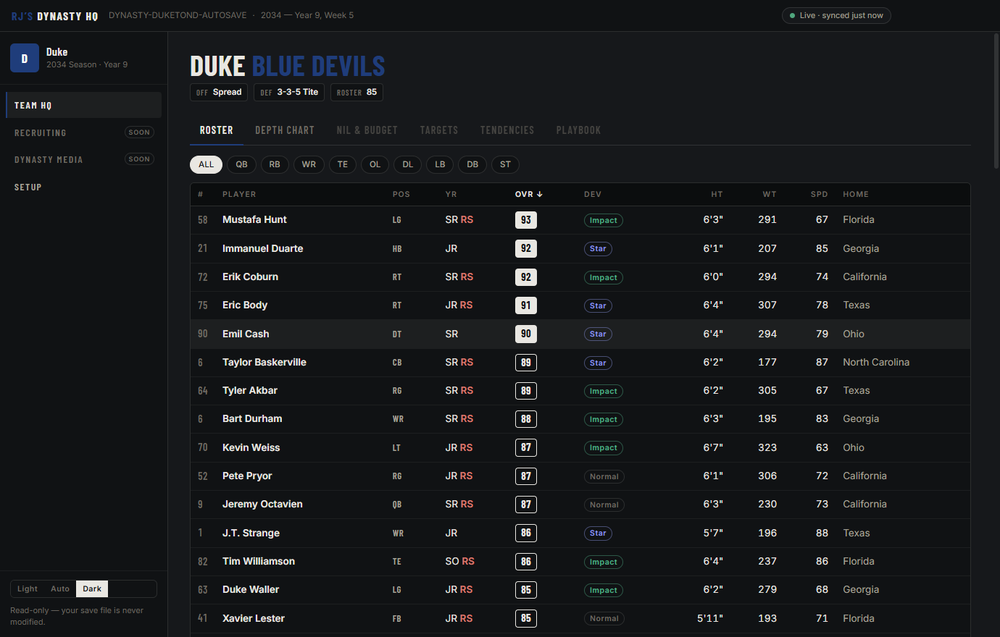

# RJ's Dynasty HQ

A live companion dashboard for **EA Sports College Football 27** dynasty mode on PC.

Point it at your dynasty save once — from then on, every time the game writes that save, the dashboard refreshes itself. No screenshots, no spreadsheets, no manual entry.



## What it does

- **Auto-sync** — watches your selected save file and re-reads it the moment the game saves. A status pill shows live/parsing/error state at all times.
- **Team HQ** — roster (overalls, dev traits, class years, redshirts, size/speed, hometowns), full depth chart including situational spots, **NIL & budget** (income pillars with grades, spending breakdown, weekly staff points, NIL commitments), **recruiting targets** with gem/bust status and pursuit races, **tendencies** (your real run/pass splits, third/fourth down and red-zone rates, plus each coach's temperament sliders), and your schemes/playcallers.
- **Recruiting** — the entire national class: every recruit's stars, gem/bust flag, dev trait, pipeline, offers, and the schools chasing them — plus your program's pipeline tiers and full report card, and **edge detection** that flags recruits where your grades and pipelines beat the actual competition.
- **Dynasty Media** — a generated news wire built by diffing your saves: game stories with margin-aware writing, poll movement, commits and flips, coaching changes, and roster churn, each filed under an outlet masthead. Real network branding by default, a fictional pack one toggle away.
- **Portrait packs** — point the app at a folder of images named by portrait ID (`1234.png`) and rosters show real faces. Hover a player's name to see their ID.
- **Team colors & themes** — the UI accents itself with your school's colors from the save; light/dark/system themes; remembers your save, school, and layout.


Everything works fully offline. Articles are generated by a deterministic template engine — no accounts, no API keys, no network calls.

## Requirements

- Windows 10/11
- EA Sports College Football 27 on PC (Steam, EA App, or Epic)
- An **offline (solo) dynasty** — online dynasty data lives on EA's servers, not in a local file

## Install

Grab the installer from the [Releases](../../releases) page and run it. That's it.

Your dynasty saves normally live in:

```
Documents\EA SPORTS College Football 27\saves\
```

The app auto-detects saves there (files starting with `DYNASTY-`) and lists them on first launch.

## Is my save safe?

Yes. The app is strictly **read-only** with your game files: it copies the save to its own cache folder before parsing and never opens your save for writing. Nothing it does can corrupt a dynasty.

## Build from source

```
npm install
npm run dev          # run in development
npm run parse:check  # parse a save from samples/ and print what the app sees
npm run dist         # build the Windows installer (release/)
```

Drop a dynasty save into `samples/` (gitignored) for `parse:check` and development.

## Credits

- Save parsing is built on [madden-franchise](https://github.com/bep713/madden-franchise) (MIT) by bep713 — the backbone of the Madden/CFB save-editing community.
- Thanks to the CFB 27 modding community for the collective knowledge about the dynasty save format.

## License

[MIT](LICENSE)
