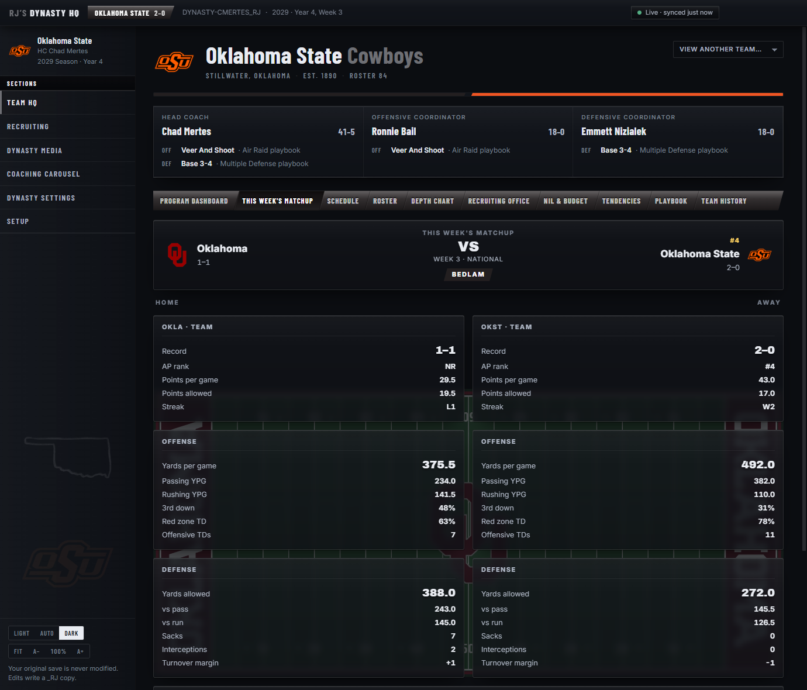
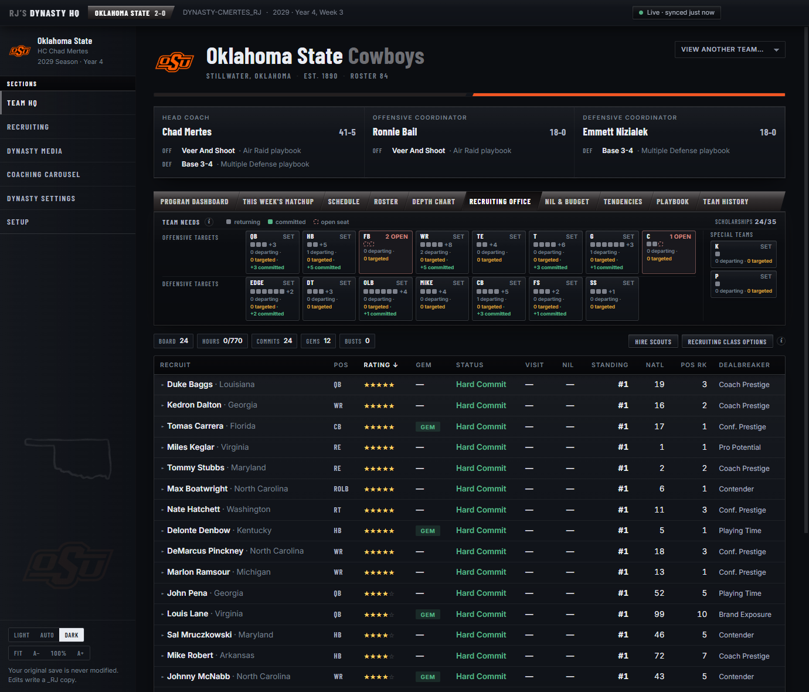
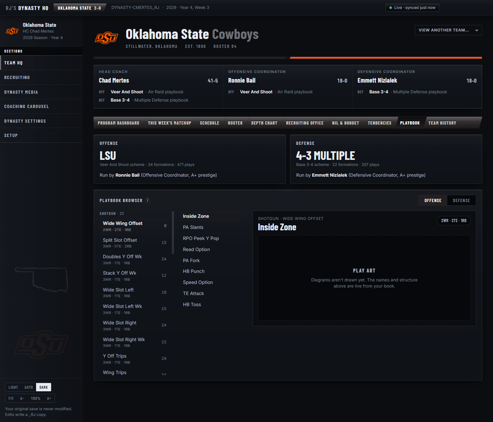
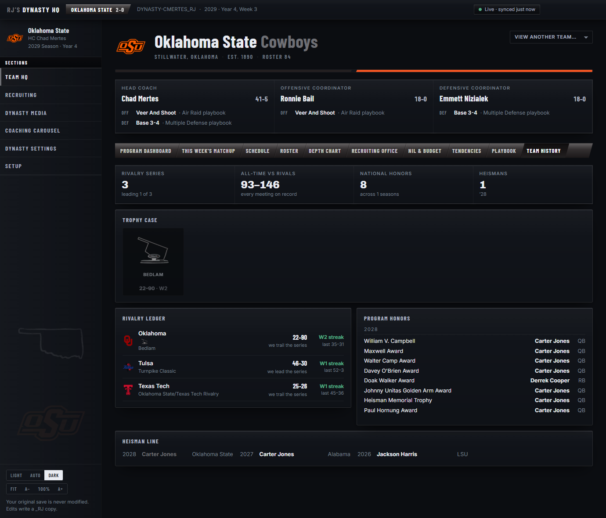
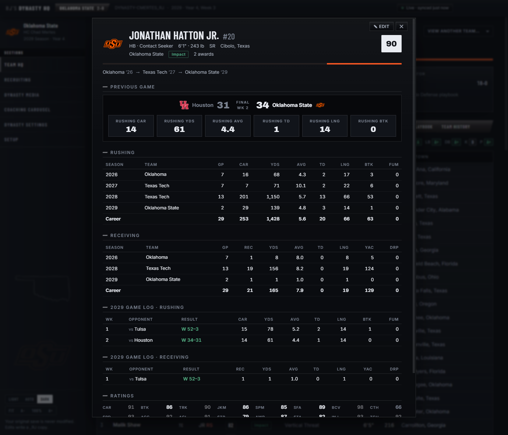
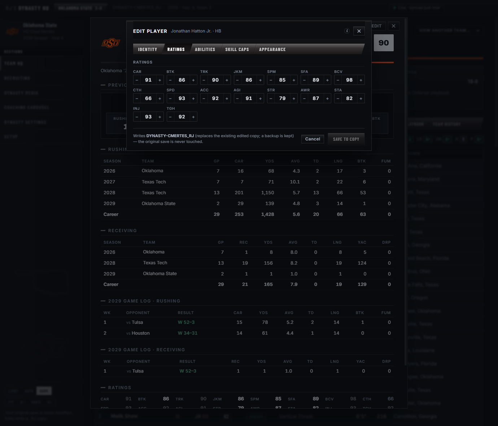
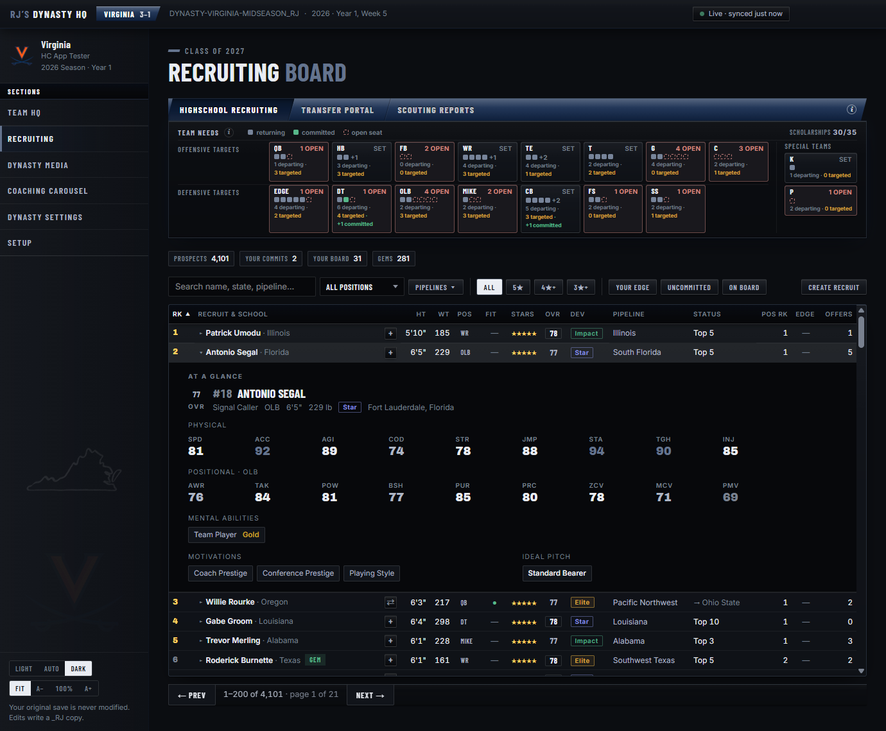
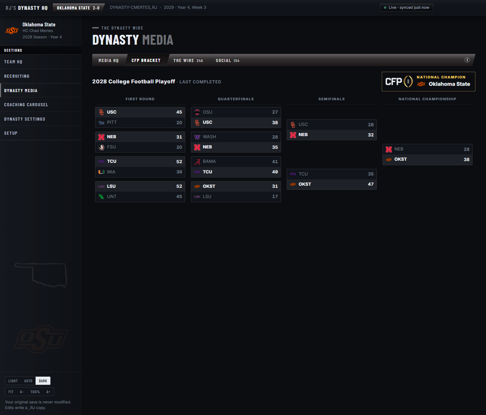
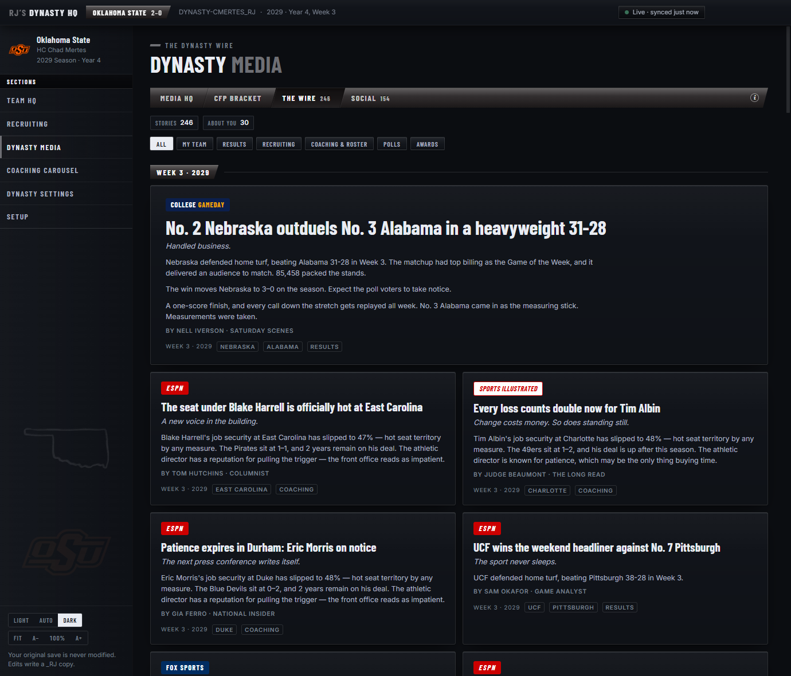
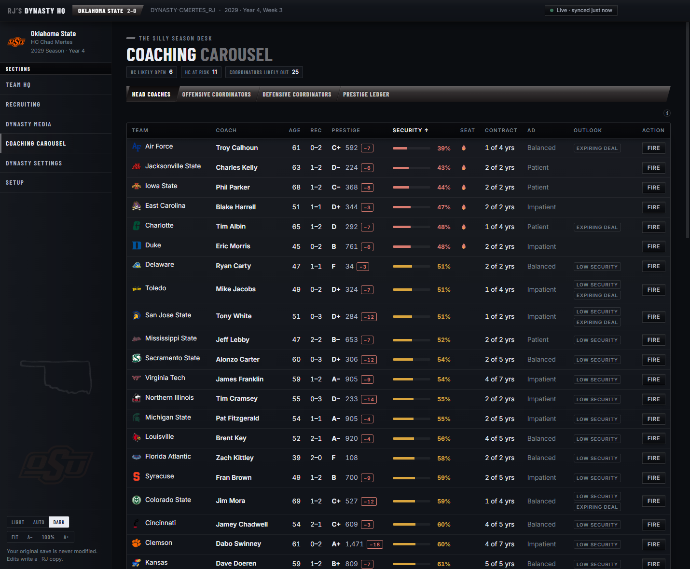

# RJ's Dynasty HQ

A live companion dashboard for **EA Sports College Football 27** dynasty mode on PC.

Point it at your dynasty save once. From then on, every time the game writes that save, the dashboard refreshes itself. No screenshots, no spreadsheets, no manual entry. When you load a different save, it finds the program you're coaching on its own.


## What it does

### Team HQ

Everything about your program in one place, set on your stadium's real field with your school's actual end-zone paint and midfield art pulled from your own installed game.

- **Program Dashboard.** A win/loss graph of your seasons in your school's colors, with national titles carrying the CFP mark and every bowl showing its own logo. Your athletic director's mandate reads out this season's expectation in the AD's own words, next to a job-security meter with your national standing, contract years remaining, and your active season goals. Below that sits your pipeline map with the game's own tier pins and your full program grades sheet, with an **Edit** that writes the ten letters and the program's star prestige straight into your save's protected copy. Each letter says how long it survives before the game re-grades it (two are permanent, six refresh weekly, two hold until the offseason; the stars are re-derived each offseason).
- **This Week's Matchup.** Your featured game laid out as a pregame board on the home team's field, home team left and away team right. Tiles compare team form, offense and defense, the series history between the two schools, and the players worth watching: award winners, record holders and national statistical leaders on either side. Rivalry games carry the trophy on the line.
- **Schedule.** The live season week by week: date and kickoff as the game has them, home or away, the opponent with its logo and AP rank, TV window, attendance, the result once played, byes in place and the next game marked. Read-only for now; preseason opponent swaps are planned once the game's own footprint for them is observed.
- **Roster & depth chart.** Overalls, dev traits, class years, redshirts, size and speed, archetypes and hometowns, with every column sortable. The depth chart edits by drag and drop: reorder any position window and save it back through the same protected copy the player editor uses.
- **Recruiting Office.** Your board under the Team Needs strip, which draws next season's 57-man floor as literal seats per position. Filled seats are returning players, gold seats are your commits, open seats are where someone still has to be signed, and departures are counted out the moment they're known. Each target row expands to an At a Glance card, and a quiet warning dot flags two of your own targets who would demand playing time at the same spot. Next to each row's Weekly Plan button sits **Instant Commit** (✓): after a confirmation step it hard-commits the recruit to your program the way the game records its own instant commits, offering a scholarship if none is out, which counts against the season cap.
- **Weekly Plan.** A per-target dialog with the game's real action prices. Assign hours, schedule visits, offer the scholarship against the hard 35-offer season cap, send the NIL offer, and set the sway pitch, with your remaining hour pool bookkept live. Options that would blow the week's budget are locked out with a plain explanation of why.
- **Build the board.** Add and drop targets right from either recruiting board, staged and saved in one write. Create Recruit invents a prospect from scratch: identity, stars, dev trait, measurables, and their whole look, with the face picked from the game's own head catalog, plus skin tone, body type, and every gear slot using real helmet and facemask compatibility.
- **NIL & Budget.** Income pillars with grades, spending, weekly staff points, and NIL commitments. Fundraising and Hire Additional Recruiters buttons write more budget or recruiting hours into your save's protected copy, and a Facilities button sets your athletic facility to any of the game's five levels (Basic through National Powerhouse), with the renewal reserve following the level, your owned equipment listed, and the letter grade's band shown for each tier.
- **Tendencies.** Your real run/pass splits, third and fourth down rates, red-zone efficiency, and each coach's temperament sliders.
- **Playbook.** The actual book your coordinators run, browsable by formation family, with personnel groupings and every play listed.
- **Team History.** A trophy case of your rivalry hardware, showing the real trophies the game models for each series, plus the rivalry ledger and your program's national honors and Heisman line. More on the trophy case below.
- **Visit any program.** The View Another Team menu opens the full Team HQ for any school in the country, every tab included.








### Team History

Your program's past, built from the save and dressed with the game's own art.

- **Trophy case.** The rivalry trophies the game actually models for your series, each real trophy render pulled from your installed game, lit up gold where your program leads the series and showing the record and current streak.
- **Rivalry ledger.** Every series your program is part of, with all-time records, live streaks and last-meeting scores, each carrying its trophy mark where one exists.
- **Program honors and Heisman line.** Every national award won at your school, listed by season, and the league's Heisman winners with yours highlighted.



### Profiles: click any name, anywhere

Every player, coach and school name in the app opens an ESPN-style profile card. Names inside a profile open more profiles, and Esc walks back out.

- **Players.** A Previous Game score bug with their line from that game as stat tiles, season-by-season and career stats (transfers show every stop), full game logs, all ratings, named abilities, and NCAA passer rating computed for every game, season and career line for quarterbacks.
- **Recruits.** Stars and ranks, the full pursuit race with influence bars, their dealbreaker, and their three motivations with the ideal pitch that matches them, straight from the game's own pitch definitions.
- **Coaches.** Bio, contract and job security, the career ledger, and their full coaching history, with **✎ Edit** opening the coach editor.
- **Schools.** A season browser with schedules and results, team stat panels, records and coaches year by year, and the all-time program ledger.
- **Real headshots.** Profiles show actual in-game player and coach portraits once you extract them from your own installed game (see below).



### Player Editor

Every player and recruit profile opens into an editor. Hit **✎ Edit**. Five tabs: Identity, Ratings, Abilities, Skill Caps, Appearance.

- **Identity.** Names, jersey number, height (edited in inches, read back as feet and inches) and weight, development trait (Normal, Impact, Star, Elite), home state and hometown.
- **Ratings and abilities.** The position's full rating sheet, mental abilities and their tiers, and physical ability tiers, all validated against the save format's real limits before a single byte is written. Every ability shows the game's own one-line description, in the editor, in profiles and on At a Glance cards.
- **Skill Caps.** The six skill-group caps from the game's Upgrade Player screen, each named for the group your player's archetype actually assigns to that slot (the game's own tuning data; a corner's six are not a tackle's six), plus the unspent skill-point balance.
- **Appearance.** A rostered player's face (picked from the game's head catalog, with portrait previews), skin tone, body type, and all eleven gear slots, with helmet and facemask combinations restricted to pairs the game actually uses.
- Every number field takes typed input as well as its − / + buttons.
- Overall recalculates in the game itself the next time it loads the save. The app never invents a number.



### Coach Editor

Every coach profile has the same **✎ Edit**, for your own coach or any CPU coach in the league. Three tabs.

- **Base Values.** Coach points, level, prestige score (the game re-grades the letter from it), experience points, and job security percentage, whose status band follows the percentage using your save's own coaches as the yardstick.
- **Coach Profile.** Names, role (changing it swaps with whoever holds that role on the same staff), age, height and weight, home state, demeanor, stance, hat and body type.
- **Coach Progression.** Dominant archetype, backstory, the Expert Scout trait, the CEO and Program Builder unlocks, and every talent tree. Each subtree opens as its own pop-up: the archetype node as a switch, then a tile per perk branch with a stepper for its level, since every branch in the game's trees is a chain of perks. Nothing is ever locked here; the editor is a sandbox, and the game evaluates its own prerequisites when it loads.

The tree definitions, names, costs and unlock chains all come from the game's own data files, not from a transcription.

### Recruiting

Filter the class by pipeline with a multi-select picker: every pipeline the class comes from, your program's tiered pipelines listed first with their tier.

Three boards over the national class, under the same Team Needs seats as the office.

- **Highschool Recruiting.** Every prospect in the class with stars, true overall, height and weight, gem/bust, dev trait, pipeline, position and national rank, offers and commit tracking. A Scheme Fit dot shows how the recruit's archetype sits in your actual scheme, filled when your scheme starts that archetype, from the game's own per-scheme preferences. The Edge arrow scores your program against the strongest school actually pursuing them: green when you hold a real advantage, red when you're behind. Clicking any recruit expands their At a Glance card with the skills their position lives on, their mental and physical abilities, and their motivations and ideal pitch.
- **Transfer Portal.** The same board for portal transfers, which fills once your save reaches the offseason window. **Manual Transfers** sits beside it: pick any two schools, see both rosters side by side (sortable by position, name, class or overall), and click players across in either direction. The write follows the game's own sign-player steps, roster lists and depth charts included, and neither school can end above the game's 85-man limit.
- **Scouting Reports.** Search the class by attribute. *Receivers with 92+ speed. Quarterbacks with 94+ throw power. Tackles over 6'6" and 300 pounds.* Stack as many thresholds as you like, and each becomes its own sortable column.




### Dynasty Media

A generated sports-media world built by diffing your saves, fully offline, with no accounts and no API calls.

- **Media HQ.** A league dashboard with a ticker that switches between the Top 25 (with logos, records and poll movement), stat leaders ranked three deep per category, and award races projected under the game's real award names. Below it: the full AP Top 25, your program's season sheet, offense and defense leaders, and the award watch.
- **CFP Bracket.** The College Football Playoff as a bracket board, rebuilt from the save's own playoff games. Four rounds flow into the champion, with team logos, scores and byes all read straight from the results. It shows the current season once it reaches December, otherwise the most recent completed bracket.
- **The Wire.** Game stories with margin-aware writing, rivalry and bowl angles, poll movement, commits and flips, coaching changes, roster churn, weekly Players of the Week, stat lines, win streaks, the annual awards show and draft day. Every article is bylined by a fictional press corps of beat writers and columnists with their own voices, and no headline or story template repeats within a season. Click any story to read the full article.
- **Social.** A timeline of posts from the wire's personalities reacting to the news as it breaks.
- Real network branding by default, with a fictional pack one toggle away.






### Coaching Carousel

A league-wide job security board for every head coach and coordinator: hot seats, contract years, and secure programs, plus an openings forecast built from save facts about who's on thin ice, whose deal is expiring, and which athletic directors have short patience.

And when a CPU coach has worn out their welcome in your league, there's **Fire Coach**. It writes the carousel's real input, the hot seat itself, into your save's protected copy, so the game's own end-of-season machinery does the deed.



### Dynasty Settings

The game's own settings screens, read from your save and editable in place: **Gameplay** (Player and CPU skill sliders, game options, penalties, tackle mechanics, wear and tear, precipitation, coach mode), **XP** (per-position XP percentages, progression frequency, coach XP and talent speed, respec rules) and **League** (coach firing, roster and transfer limits, recruit flipping, injuries, play-calling limits, and your own program's season settings). Every value is validated against the save format before anything is written, and the changes go to the same protected copy as every other editor. Settings the game fixes when a dynasty is created are shown read-only, and Quarter Length is held read-only for now.

### Throughout

- **Auto-sync.** Watches your save and re-reads it the moment the game writes. A status pill shows live, parsing or error at all times.
- **Knows whose dynasty it is.** Loading a save selects the program you're coaching automatically. A save with several user-controlled teams asks which one is yours.
- **Knows where your game is.** The install is auto-detected across Steam libraries and the usual locations. If yours lives somewhere unusual, point Setup at the folder once.
- **Real branding.** All 138 team logos and every bowl logo ship with the app. No downloads, no setup.
- **Correct names.** Archetypes, award names, pitch names and ability names all read the way the game shows them, extracted from the game's own data rather than transcribed. The identifiers lie: the save calls the "Gamer" pitch `ItsGameTime`.
- **Team colors & themes.** The UI accents itself with your school's colors from the save. Light, dark and system themes, an interface scale that fits itself to your window, and it remembers your save, school and window.
- **Diagnostics you can actually report.** The app keeps a small local log, and every error carries a short stable code (like `HQ-3F2A`). If something misbehaves, **Setup → Copy report** puts your version, environment and recent log on the clipboard, ready to paste into a bug report.

Everything works fully offline. Articles come from a deterministic template engine, with no accounts, no API keys and no network calls. The only exception is an optional launch-time update check, which you can switch off.

## Requirements

- Windows 10/11
- EA Sports College Football 27 on PC (Steam, EA App, or Epic)
- An **offline (solo) dynasty**. Online dynasty data lives on EA's servers, not in a local file.

## Install

Grab the installer from the [Releases](../../releases) page and run it. That's it.

Your dynasty saves normally live in:

```
Documents\EA SPORTS College Football 27\saves\
```

The app auto-detects saves there (files starting with `DYNASTY-`) and lists them on first launch.

One thing worth knowing about the game itself: it loads a save to a blank screen when the file name is longer than 32 characters. The app keeps its own edited copies within that limit and warns you in Setup if the file you have selected is over it.

## Portraits and game art

Profiles can show the game's real player and coach headshots. Because that art belongs to your installed copy of the game, it never ships with the app. You extract it yourself, once:

```
node scripts/extract-portraits.ts <your-save> <output-folder> --recruits
```

This reads your own install, pulls the portraits for your roster, the whole recruiting class and every coach, and writes them as PNGs. Texture decoding is built in, so plain Node is all it takes. Point the portrait folder in **Setup** at the output and every profile gains its headshot. The folder also accepts community portrait packs named by portrait id.

The same goes for the rest of the game's art the app can use: your stadium's field paint, the rivalry logos and trophies, state silhouettes, and interface icons.

```
node scripts/extract-field-art.ts
node scripts/extract-rivalry-art.ts
node scripts/extract-state-icons.ts
node scripts/extract-game-icons.ts
```

Each reads your install (found automatically, or set in **Setup → Game installation**) and drops PNGs where the app looks for them. Without them the app falls back to drawn stand-ins.

## Is my save safe?

Yes. The app never modifies your save. It copies the file to its own cache folder before parsing and never opens the original for writing.

The editors follow the same rule by writing somewhere else entirely. Using **Edit** creates a separate copy of your dynasty named `<save>_RJ` next to the original and puts the changes there. Your original file keeps its exact bytes. Re-editing an edited copy updates that copy in place, after a timestamped backup is stored in the app's data folder. Load the `_RJ` save in the game to play with your changes. Every save-writing feature (the player and coach editors, depth chart drag-and-drop, board edits, weekly plans, resources, Fire Coach, Create Recruit, Manual Transfers) goes through this one path.

Two more safeguards:

- **Vanilla backups.** Before the first edited copy of a save is written, the untouched original is also copied under the app's data folder. **Setup → Back up now** does the same for every game-written save in your saves folder at any time, skipping files whose bytes it already keeps, and **Open backups folder** takes you there.
- **File names the game can load.** The game loads a save to a blank screen when its file name is longer than 32 characters. Edited copies are named to fit (an autosave's `-AUTOSAVE` marker is dropped and long names are shortened), and Setup warns if the file you have selected is over the limit. Copies made by earlier versions with the longer `_RJsEdited` suffix still work when they fit, and move to the short name on their next edit.

## Build from source

```
npm install
npm run dev          # run in development
npm run parse:check  # parse a save from samples/ and print what the app sees
npm run dist         # build the Windows installer (release/)
```

Drop a dynasty save into `samples/` (gitignored) for `parse:check` and development.

Developer tools worth knowing about:

```
node scripts/filter-check.ts     # assert the recruiting filters and scouting queries hold
node scripts/profile-check.ts    # regression suite over the profile extractor
node scripts/media-check.ts      # run the media engine against a save and audit its output
node --max-old-space-size=16384 scripts/edit-check.ts   # regression suite over the player editor's save writes
node scripts/bc-check.ts         # prove the built-in texture decoder byte-exact against a reference
node scripts/extract-awards.ts   # regenerate award names from the installed game
node scripts/extract-pitches.ts  # regenerate pitch names + motivations from the installed game
```

## Credits

- Save parsing is built on [madden-franchise](https://github.com/bep713/madden-franchise) (MIT) by bep713, the backbone of the Madden/CFB save-editing community.
- Thanks to the CFB 27 modding community for the collective knowledge about the dynasty save format.

## License

[MIT](LICENSE)
